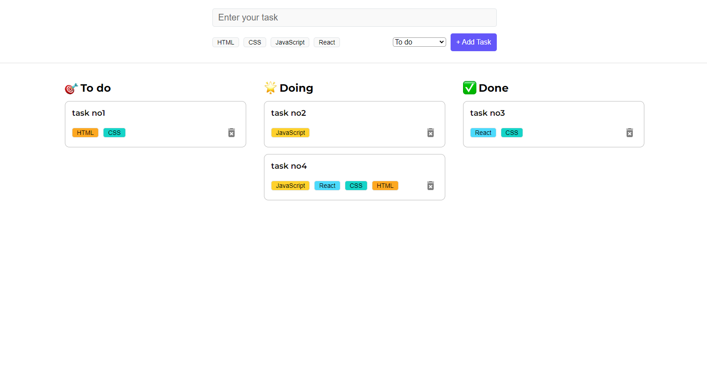

# ReactJS TastTrek Application Project

## Technologies used:

 

## General purpose and features included:

This is my first ReactJS project, a 'tasktrek' application. You can also find some [JavaScript](https://github.com/vesrozeno/react-tasktrek-application/blob/main/javascript.md) and [React](https://github.com/vesrozeno/react-tasktrek-application/blob/main/react.md) basic concepts markdown files that I studied in my [ReactJS course](https://www.udemy.com/course/the-ultimate-react-course-2023-w-real-world-projects/).

Basically, is an application where you can manage your tasks, separating them by _**"to do", "doing" and "done"**_.
There's also the possibility to include tags for each task. Tags implemented are: _**HTML, CSS, JavaScript and React**_.

